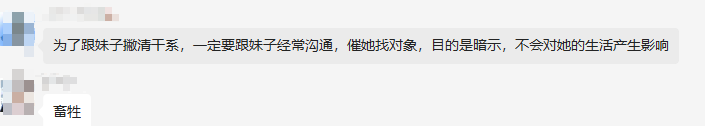

# 瓜氏春秋

## 正版摘录

1. 你要跟妹子称兄道弟，然后朋友嘛，都是成年人，大不了累了一起睡睡觉
2. 一定不要舔狗，让妹子觉得你对她不屑，你不 care

    举个例子：

    
3. 为了跟妹子撇清干系，一定要跟妹子经常沟通，催她找对象，目的是暗示，不会对她的生活产生影响

    群友评价：

    
4. 妹子注重的是安全，一定要让妹子明白你只会走进她的身体，不会走进她的生活。—— 瓜哥名言
5. 瘦的妹子比较乐意自己动
6. 高质量的女的，对男的外貌要求都是一般就可以，更注重细节，责任心,潜力股，未来
7. 帅不帅不重要，一定要有气场，你征服不了的妹子一定不崇拜你。所有的女的，只崇拜比她强的男的。
8. 其实妹子啥也不要，你们觉得坐着聊天和睡下聊天有什么区别，没区别。难就难在，你怎么让妹子也觉得没区别。
9. 水少（少的概率特别小，看年龄）的妹子说明实战太多了，避雷。腿软说明专注，肯定极品。
10. 多来几次500块的爱情，你就发现就是那回事。别把女人太当回事，你拿她太当回事，她就真拿自己当回事。
11. 看内衣是不是套装，穿套装的一般就是主动出击的
12. 如果你喜欢一朵花，你会把它摘了带回去；如果你爱一朵花，你会给它保护起来不让别人破坏。喜欢是欣赏，爱是参与；看话剧属于喜欢，演话剧属于爱。
‍

‍

## 其他摘录

1. 当你洗澡的时候，感觉洗澡水忽冷忽热，就要明白有人和你共用一个水源了。
2. 只要你别太把恋爱当回事，它就没有那么难。有恋爱谈就谈，没恋爱谈就算了，有恋爱谈的时候，也别整天想着，万一分手了该怎么办……很多恋爱之所以最后被谈得一团糟，就是因为太在乎了，伤人伤己。
3. 当你发现一个妹子突然开放了朋友圈，那么她一定是加了个新的男的。
4. 情人节想日你的人，现在开始会找你聊天了
5. 舔一个人是舔狗，舔一百个人就是海王。
6. 三三三三定律要牢记于心，发三次消息不回，三次邀约被拒，见面三次无一次肢体接触，三个月没确定关系。好了，下一个更好。
7. 来个不恰当的比喻。养条狗，喂它两天骨头，它见了我还会摇一摇尾巴，叫两声呢。
8. 男人，是不会对一个对他爱答不理的女生穷追不舍的。